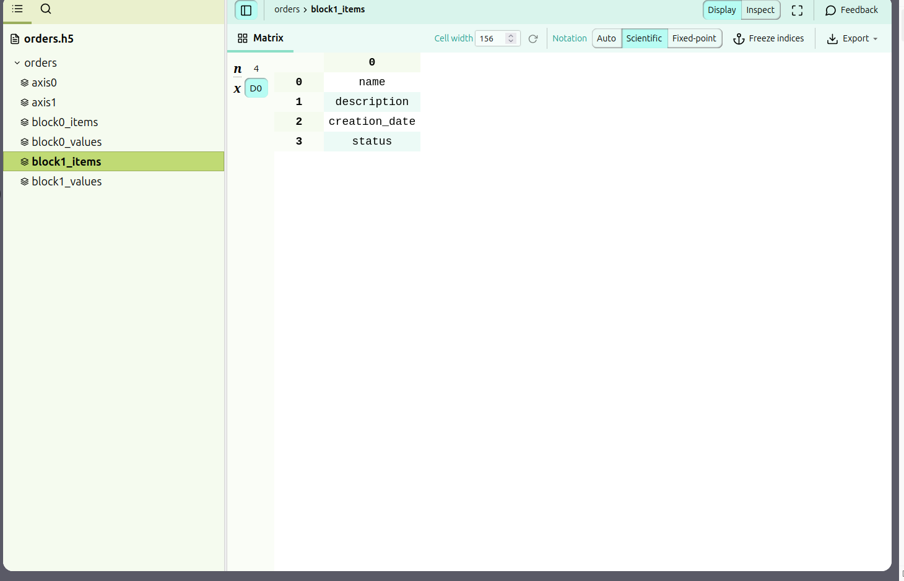

Order Management System

The Order Management System is a Flask-based application designed to help companies manage their orders efficiently. 
It provides functionalities for adding, editing, and deleting orders, generating reports, performing data analysis, 
and exporting/importing order data to/from different file formats.

Features:
- CRUD Operations: Add, edit, and delete orders through a user-friendly interface. 
- Report Generation: Generate reports in XLSX format with colored rows based on order status. 
- Data Analysis: Get statistics about orders, such as the count of orders in each status. 
- File Handling: Export and import order data to/from HDF5 and XML files:
- XML example 
- HDF5 example  
- Bulk Order Status Update: Update the status of multiple orders at once.

Installation:
1. git clone https://github.com/TsybuliaRoman/order_management
2. cd order_management
3. pip install -r requirements.txt
4. python order_management/app/app.py
5. Access the application in your web browser at http://localhost:5000.

Testing:
- cd app
- python -m pytest tests

Usage:
- Add, edit, or delete orders using the provided interface. 
- Generate reports and export them to XLSX format. 
- Perform data analysis to get insights into order statuses. 
- Export/import order data to/from HDF5 and XML files. 
- Bulk update order statuses as needed.
